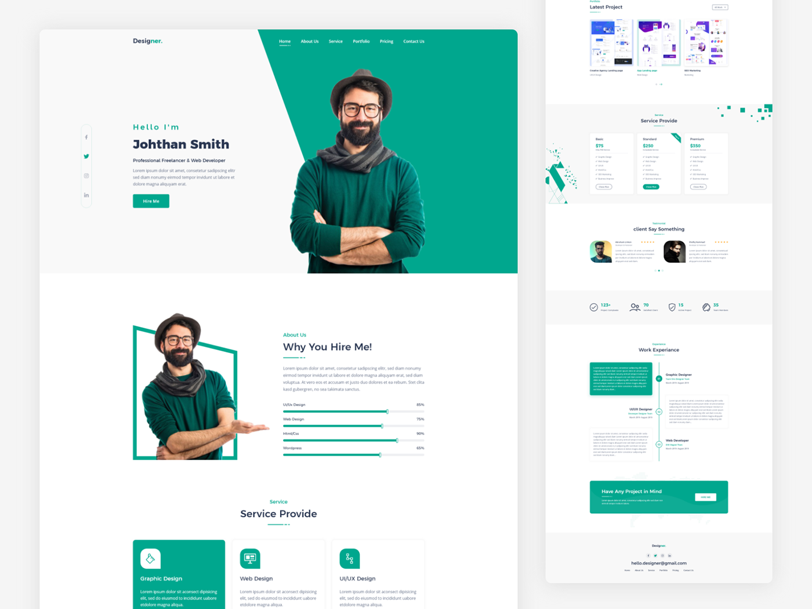
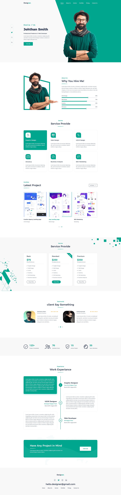

<h1>Trabajo Final</h1>
<h4> :sunny: Alumna: Roa María Sol</h4>
<h3>Diplomatura en diseño Web y Multimedial</h3>

El proyecto inicia desde la pauta de codificar un diseño de una Landing Page personal, en mi caso de la página BEHANCE. El código lo realizo a través de HTML y CSS. Esto se lleva a cabo para la aprobación de la Diplomatura de diseño web y multimedial del centro de e-learning de la universidad tecnológica nacional de buenos aires (UTN.BA). 

<h2><svg xmlns="http://www.w3.org/2000/svg" width="16" height="16" fill="#00A78E" class="bi bi-bookmarks-fill" viewBox="0 0 16 16">
  <path d="M2 4a2 2 0 0 1 2-2h6a2 2 0 0 1 2 2v11.5a.5.5 0 0 1-.777.416L7 13.101l-4.223 2.815A.5.5 0 0 1 2 15.5V4z"/>
  <path d="M4.268 1A2 2 0 0 1 6 0h6a2 2 0 0 1 2 2v11.5a.5.5 0 0 1-.777.416L13 13.768V2a1 1 0 0 0-1-1H4.268z"/>
</svg>   Diseño elegido</h2>
<svg  href="https://www.behance.net/gallery/90079519/Resume-Landing-page" xmlns="http://www.w3.org/2000/svg" width="26" height="16" fill="#00A78E" class="bi bi-behance" viewBox="0 0 16 16">
  <path d="M4.654 3c.461 0 .887.035 1.278.14.39.07.711.216.996.391.286.176.497.426.641.747.14.32.216.711.216 1.137 0 .496-.106.922-.356 1.242-.215.32-.566.606-.997.817.606.176 1.067.496 1.348.922.281.426.461.957.461 1.563 0 .496-.105.922-.285 1.278a2.317 2.317 0 0 1-.782.887c-.32.215-.711.39-1.137.496a5.329 5.329 0 0 1-1.278.176L0 12.803V3h4.654zm-.285 3.978c.39 0 .71-.105.957-.285.246-.18.355-.497.355-.887 0-.216-.035-.426-.105-.567a.981.981 0 0 0-.32-.355 1.84 1.84 0 0 0-.461-.176c-.176-.035-.356-.035-.567-.035H2.17v2.31c0-.005 2.2-.005 2.2-.005zm.105 4.193c.215 0 .426-.035.606-.07.176-.035.356-.106.496-.216s.25-.215.356-.39c.07-.176.14-.391.14-.641 0-.496-.14-.852-.426-1.102-.285-.215-.676-.32-1.137-.32H2.17v2.734h2.305v.005zm6.858-.035c.286.285.711.426 1.278.426.39 0 .746-.106 1.032-.286.285-.215.46-.426.53-.64h1.74c-.286.851-.712 1.457-1.278 1.848-.566.355-1.243.566-2.06.566a4.135 4.135 0 0 1-1.527-.285 2.827 2.827 0 0 1-1.137-.782 2.851 2.851 0 0 1-.712-1.172c-.175-.461-.25-.957-.25-1.528 0-.531.07-1.032.25-1.493.18-.46.426-.852.747-1.207.32-.32.711-.606 1.137-.782a4.018 4.018 0 0 1 1.493-.285c.606 0 1.137.105 1.598.355.46.25.817.532 1.102.958.285.39.496.851.641 1.348.07.496.105.996.07 1.563h-5.15c0 .58.21 1.11.496 1.396zm2.24-3.732c-.25-.25-.642-.391-1.103-.391-.32 0-.566.07-.781.176-.215.105-.356.25-.496.39a.957.957 0 0 0-.25.497c-.036.175-.07.32-.07.46h3.196c-.07-.526-.25-.882-.497-1.132zm-3.127-3.728h3.978v.957h-3.978v-.957z"/>
</svg>

<h2><svg xmlns="http://www.w3.org/2000/svg" width="16" height="16" fill="#00A78E" class="bi bi-bookmarks-fill" viewBox="0 0 16 16">
  <path d="M2 4a2 2 0 0 1 2-2h6a2 2 0 0 1 2 2v11.5a.5.5 0 0 1-.777.416L7 13.101l-4.223 2.815A.5.5 0 0 1 2 15.5V4z"/>
  <path d="M4.268 1A2 2 0 0 1 6 0h6a2 2 0 0 1 2 2v11.5a.5.5 0 0 1-.777.416L13 13.768V2a1 1 0 0 0-1-1H4.268z"/>
</svg>  Ejecución</h2>

<h5><svg xmlns="http://www.w3.org/2000/svg" width="16" height="16" fill="yellow" class="bi bi-lightbulb" viewBox="0 0 16 16">
  <path d="M2 6a6 6 0 1 1 10.174 4.31c-.203.196-.359.4-.453.619l-.762 1.769A.5.5 0 0 1 10.5 13a.5.5 0 0 1 0 1 .5.5 0 0 1 0 1l-.224.447a1 1 0 0 1-.894.553H6.618a1 1 0 0 1-.894-.553L5.5 15a.5.5 0 0 1 0-1 .5.5 0 0 1 0-1 .5.5 0 0 1-.46-.302l-.761-1.77a1.964 1.964 0 0 0-.453-.618A5.984 5.984 0 0 1 2 6zm6-5a5 5 0 0 0-3.479 8.592c.263.254.514.564.676.941L5.83 12h4.342l.632-1.467c.162-.377.413-.687.676-.941A5 5 0 0 0 8 1z"/>
</svg> Antes de empezar</h5>
Antes de empezar a codificar el trabajo realizé prácticas, además de las propuestas en clase, los challenges de Frontend Mentor, tres de ellas se encentran en la sección portafolio dentro de la misma Landing Page en cuenstión, esto para entrender el funcionamiento de la disposición de los distintos elementos de la página, apender nuevas etiquetas, aplicar fuentes tipográficas, imégenes, etc. A grandes razagos para aplicar lo visto en clase en algo que se asemeje al trabajo final. 

<h5><svg xmlns="http://www.w3.org/2000/svg" width="15" height="15" fill="grey" class="bi bi-alarm-fill" viewBox="0 0 16 16">
  <path d="M6 .5a.5.5 0 0 1 .5-.5h3a.5.5 0 0 1 0 1H9v1.07a7.001 7.001 0 0 1 3.274 12.474l.601.602a.5.5 0 0 1-.707.708l-.746-.746A6.97 6.97 0 0 1 8 16a6.97 6.97 0 0 1-3.422-.892l-.746.746a.5.5 0 0 1-.707-.708l.602-.602A7.001 7.001 0 0 1 7 2.07V1h-.5A.5.5 0 0 1 6 .5zm2.5 5a.5.5 0 0 0-1 0v3.362l-1.429 2.38a.5.5 0 1 0 .858.515l1.5-2.5A.5.5 0 0 0 8.5 9V5.5zM.86 5.387A2.5 2.5 0 1 1 4.387 1.86 8.035 8.035 0 0 0 .86 5.387zM11.613 1.86a2.5 2.5 0 1 1 3.527 3.527 8.035 8.035 0 0 0-3.527-3.527z"/>
</svg> Comenzando el trabajo</h5>
Luego de practicar y hacercandose la fecha de entrega, comienzo la codificación de del diseño elegido.  
Para ello fui avanzado por secciones, realizando primero el código de HTML, las etiquetas y la parte textual del mismo y luego, casi a la par la edición visual del mismo en el CSS.

<h5><svg xmlns="http://www.w3.org/2000/svg" width="16" height="16" fill="pink" class="bi bi-paint-bucket" viewBox="0 0 16 16">
  <path d="M6.192 2.78c-.458-.677-.927-1.248-1.35-1.643a2.972 2.972 0 0 0-.71-.515c-.217-.104-.56-.205-.882-.02-.367.213-.427.63-.43.896-.003.304.064.664.173 1.044.196.687.556 1.528 1.035 2.402L.752 8.22c-.277.277-.269.656-.218.918.055.283.187.593.36.903.348.627.92 1.361 1.626 2.068.707.707 1.441 1.278 2.068 1.626.31.173.62.305.903.36.262.05.64.059.918-.218l5.615-5.615c.118.257.092.512.05.939-.03.292-.068.665-.073 1.176v.123h.003a1 1 0 0 0 1.993 0H14v-.057a1.01 1.01 0 0 0-.004-.117c-.055-1.25-.7-2.738-1.86-3.494a4.322 4.322 0 0 0-.211-.434c-.349-.626-.92-1.36-1.627-2.067-.707-.707-1.441-1.279-2.068-1.627-.31-.172-.62-.304-.903-.36-.262-.05-.64-.058-.918.219l-.217.216zM4.16 1.867c.381.356.844.922 1.311 1.632l-.704.705c-.382-.727-.66-1.402-.813-1.938a3.283 3.283 0 0 1-.131-.673c.091.061.204.15.337.274zm.394 3.965c.54.852 1.107 1.567 1.607 2.033a.5.5 0 1 0 .682-.732c-.453-.422-1.017-1.136-1.564-2.027l1.088-1.088c.054.12.115.243.183.365.349.627.92 1.361 1.627 2.068.706.707 1.44 1.278 2.068 1.626.122.068.244.13.365.183l-4.861 4.862a.571.571 0 0 1-.068-.01c-.137-.027-.342-.104-.608-.252-.524-.292-1.186-.8-1.846-1.46-.66-.66-1.168-1.32-1.46-1.846-.147-.265-.225-.47-.251-.607a.573.573 0 0 1-.01-.068l3.048-3.047zm2.87-1.935a2.44 2.44 0 0 1-.241-.561c.135.033.324.11.562.241.524.292 1.186.8 1.846 1.46.45.45.83.901 1.118 1.31a3.497 3.497 0 0 0-1.066.091 11.27 11.27 0 0 1-.76-.694c-.66-.66-1.167-1.322-1.458-1.847z"/>
</svg> Tipografías y Colores</h5>
A la par de haber empezado el proyecto, comienzo a necestiar identificar las tipografías utilizadas en los textos, para ello utilizé distintas aplicaciones móviles, más que nada FindFont. Luego para los colores utilicé una extención de google presentada en clase.

<h2><svg xmlns="http://www.w3.org/2000/svg" width="16" height="16" fill="#00A78E" class="bi bi-bookmarks-fill" viewBox="0 0 16 16">
  <path d="M2 4a2 2 0 0 1 2-2h6a2 2 0 0 1 2 2v11.5a.5.5 0 0 1-.777.416L7 13.101l-4.223 2.815A.5.5 0 0 1 2 15.5V4z"/>
  <path d="M4.268 1A2 2 0 0 1 6 0h6a2 2 0 0 1 2 2v11.5a.5.5 0 0 1-.777.416L13 13.768V2a1 1 0 0 0-1-1H4.268z"/>
</svg> Secciones</h2>
<h5><svg xmlns="http://www.w3.org/2000/svg" width="16" height="16" fill="blue" class="bi bi-balloon-fill" viewBox="0 0 16 16">
  <path fill-rule="evenodd" d="M8.48 10.901C11.211 10.227 13 7.837 13 5A5 5 0 0 0 3 5c0 2.837 1.789 5.227 4.52 5.901l-.244.487a.25.25 0 1 0 .448.224l.04-.08c.009.17.024.315.051.45.068.344.208.622.448 1.102l.013.028c.212.422.182.85.05 1.246-.135.402-.366.751-.534 1.003a.25.25 0 0 0 .416.278l.004-.007c.166-.248.431-.646.588-1.115.16-.479.212-1.051-.076-1.629-.258-.515-.365-.732-.419-1.004a2.376 2.376 0 0 1-.037-.289l.008.017a.25.25 0 1 0 .448-.224l-.244-.487ZM4.352 3.356a4.004 4.004 0 0 1 3.15-2.325C7.774.997 8 1.224 8 1.5c0 .276-.226.496-.498.542-.95.162-1.749.78-2.173 1.617a.595.595 0 0 1-.52.341c-.346 0-.599-.329-.457-.644Z"/>
</svg> Header y Hero</h5>
Estas dos secciones fueron editas visulamente a la par, ya que compartían el fondo. Luego animé con una animación de tipo hover al navegador, que más adelante la tentrán los títulos de las demás secciones y a la pequeña sección que se encuntra del lado izquierdo de la pantalla que contiene mis redes sociales. Luego mi imágen personal la tomé desde un celular y quité el fondo desde una aplicación de edición de imágenes. 

<h5><svg xmlns="http://www.w3.org/2000/svg" width="16" height="16" fill="blue" class="bi bi-balloon-fill" viewBox="0 0 16 16">
  <path fill-rule="evenodd" d="M8.48 10.901C11.211 10.227 13 7.837 13 5A5 5 0 0 0 3 5c0 2.837 1.789 5.227 4.52 5.901l-.244.487a.25.25 0 1 0 .448.224l.04-.08c.009.17.024.315.051.45.068.344.208.622.448 1.102l.013.028c.212.422.182.85.05 1.246-.135.402-.366.751-.534 1.003a.25.25 0 0 0 .416.278l.004-.007c.166-.248.431-.646.588-1.115.16-.479.212-1.051-.076-1.629-.258-.515-.365-.732-.419-1.004a2.376 2.376 0 0 1-.037-.289l.008.017a.25.25 0 1 0 .448-.224l-.244-.487ZM4.352 3.356a4.004 4.004 0 0 1 3.15-2.325C7.774.997 8 1.224 8 1.5c0 .276-.226.496-.498.542-.95.162-1.749.78-2.173 1.617a.595.595 0 0 1-.52.341c-.346 0-.599-.329-.457-.644Z"/>
</svg> Sobre Mi</h5>
En esta sección se encuentra el porqué elegí esta página web, había practicado las barras de progreso animadas y me encantaba el resultado, por lo tnato quería tenerlas en mi landing page del trabajo. En esta sección también tengo una imagen personal con las mismas características de ejecución que la de la sección hero, con la diferencia de que para el marco de la misma utilice clip-path.

<h5><svg xmlns="http://www.w3.org/2000/svg" width="16" height="16" fill="blue" class="bi bi-balloon-fill" viewBox="0 0 16 16">
  <path fill-rule="evenodd" d="M8.48 10.901C11.211 10.227 13 7.837 13 5A5 5 0 0 0 3 5c0 2.837 1.789 5.227 4.52 5.901l-.244.487a.25.25 0 1 0 .448.224l.04-.08c.009.17.024.315.051.45.068.344.208.622.448 1.102l.013.028c.212.422.182.85.05 1.246-.135.402-.366.751-.534 1.003a.25.25 0 0 0 .416.278l.004-.007c.166-.248.431-.646.588-1.115.16-.479.212-1.051-.076-1.629-.258-.515-.365-.732-.419-1.004a2.376 2.376 0 0 1-.037-.289l.008.017a.25.25 0 1 0 .448-.224l-.244-.487ZM4.352 3.356a4.004 4.004 0 0 1 3.15-2.325C7.774.997 8 1.224 8 1.5c0 .276-.226.496-.498.542-.95.162-1.749.78-2.173 1.617a.595.595 0 0 1-.52.341c-.346 0-.599-.329-.457-.644Z"/>
</svg> Servicios</h5>
Esta sección tiene como principal las 6 "tarjetas" ubicadas en el centro de la pantalla, estas contienen información sobre distintas abilidades que puedo brindar a la hora de trabajar, no todas son ciertas pero a lo largo de mi carrera espero poder completarlas con infmación verídica. Para la ejecucíon de esta seccion tengo varias etiquetas div y cada una de ellas responde a una animación.

<h5><svg xmlns="http://www.w3.org/2000/svg" width="16" height="16" fill="blue" class="bi bi-balloon-fill" viewBox="0 0 16 16">
  <path fill-rule="evenodd" d="M8.48 10.901C11.211 10.227 13 7.837 13 5A5 5 0 0 0 3 5c0 2.837 1.789 5.227 4.52 5.901l-.244.487a.25.25 0 1 0 .448.224l.04-.08c.009.17.024.315.051.45.068.344.208.622.448 1.102l.013.028c.212.422.182.85.05 1.246-.135.402-.366.751-.534 1.003a.25.25 0 0 0 .416.278l.004-.007c.166-.248.431-.646.588-1.115.16-.479.212-1.051-.076-1.629-.258-.515-.365-.732-.419-1.004a2.376 2.376 0 0 1-.037-.289l.008.017a.25.25 0 1 0 .448-.224l-.244-.487ZM4.352 3.356a4.004 4.004 0 0 1 3.15-2.325C7.774.997 8 1.224 8 1.5c0 .276-.226.496-.498.542-.95.162-1.749.78-2.173 1.617a.595.595 0 0 1-.52.341c-.346 0-.599-.329-.457-.644Z"/>
</svg> Portafolio</h5>
Aqui muestro los challenges anteriormente mencionados, al hacer clic en ellos se abren en otra pantalla. Esta pensada para que funcione como una galería pero, se necesitaría JavaScript para ello y no lo veo en este curso por lo tanto las flechas ubicades de bajo de los trabajos no funcionan.

<h5><svg xmlns="http://www.w3.org/2000/svg" width="16" height="16" fill="blue" class="bi bi-balloon-fill" viewBox="0 0 16 16">
  <path fill-rule="evenodd" d="M8.48 10.901C11.211 10.227 13 7.837 13 5A5 5 0 0 0 3 5c0 2.837 1.789 5.227 4.52 5.901l-.244.487a.25.25 0 1 0 .448.224l.04-.08c.009.17.024.315.051.45.068.344.208.622.448 1.102l.013.028c.212.422.182.85.05 1.246-.135.402-.366.751-.534 1.003a.25.25 0 0 0 .416.278l.004-.007c.166-.248.431-.646.588-1.115.16-.479.212-1.051-.076-1.629-.258-.515-.365-.732-.419-1.004a2.376 2.376 0 0 1-.037-.289l.008.017a.25.25 0 1 0 .448-.224l-.244-.487ZM4.352 3.356a4.004 4.004 0 0 1 3.15-2.325C7.774.997 8 1.224 8 1.5c0 .276-.226.496-.498.542-.95.162-1.749.78-2.173 1.617a.595.595 0 0 1-.52.341c-.346 0-.599-.329-.457-.644Z"/>
</svg> Experiencia</h5>
En esta parte se puede observar un línea de tiempo, para la misma utilicé atributos como position, display flex, etc. Tambíen se encuentra animada con KeyFrames para su entrada y movimiento, luego tiene también una animación de tipo hover.

<h5><svg xmlns="http://www.w3.org/2000/svg" width="16" height="16" fill="blue" class="bi bi-balloon-fill" viewBox="0 0 16 16">
  <path fill-rule="evenodd" d="M8.48 10.901C11.211 10.227 13 7.837 13 5A5 5 0 0 0 3 5c0 2.837 1.789 5.227 4.52 5.901l-.244.487a.25.25 0 1 0 .448.224l.04-.08c.009.17.024.315.051.45.068.344.208.622.448 1.102l.013.028c.212.422.182.85.05 1.246-.135.402-.366.751-.534 1.003a.25.25 0 0 0 .416.278l.004-.007c.166-.248.431-.646.588-1.115.16-.479.212-1.051-.076-1.629-.258-.515-.365-.732-.419-1.004a2.376 2.376 0 0 1-.037-.289l.008.017a.25.25 0 1 0 .448-.224l-.244-.487ZM4.352 3.356a4.004 4.004 0 0 1 3.15-2.325C7.774.997 8 1.224 8 1.5c0 .276-.226.496-.498.542-.95.162-1.749.78-2.173 1.617a.595.595 0 0 1-.52.341c-.346 0-.599-.329-.457-.644Z"/>
</svg> Contácto</h5>
La sección contácto se encuentra al final de la página el footer o pie de página. En ella se encuntra mi mail personal, redes sociales y el mismo navegador del herder. Podemos acceder a él desde el navegador del header, al igual que a todas las demás secciones o desde el bóton Contáctame ubicado en el hero. 

<h2> <svg xmlns="http://www.w3.org/2000/svg" width="16" height="16" fill="#00A78E" class="bi bi-bookmarks-fill" viewBox="0 0 16 16">
  <path d="M2 4a2 2 0 0 1 2-2h6a2 2 0 0 1 2 2v11.5a.5.5 0 0 1-.777.416L7 13.101l-4.223 2.815A.5.5 0 0 1 2 15.5V4z"/>
  <path d="M4.268 1A2 2 0 0 1 6 0h6a2 2 0 0 1 2 2v11.5a.5.5 0 0 1-.777.416L13 13.768V2a1 1 0 0 0-1-1H4.268z"/>
</svg> Secciones no codificadas</h2>
Luego de consultar en clase y a través de la lectura de las pautas del trabajo, quité varias secciones del diseño original, estas son servicios, testimonios y el "cartel" de color verde de contratación. 

<h2><svg xmlns="http://www.w3.org/2000/svg" width="16" height="16" fill="#00A78E" class="bi bi-bookmarks-fill" viewBox="0 0 16 16">
  <path d="M2 4a2 2 0 0 1 2-2h6a2 2 0 0 1 2 2v11.5a.5.5 0 0 1-.777.416L7 13.101l-4.223 2.815A.5.5 0 0 1 2 15.5V4z"/>
  <path d="M4.268 1A2 2 0 0 1 6 0h6a2 2 0 0 1 2 2v11.5a.5.5 0 0 1-.777.416L13 13.768V2a1 1 0 0 0-1-1H4.268z"/>
</svg> Que aprendí...</h2>
Luego de finalizar el trabajo, quiero dar una pequeña conclución de lo aprendido. Más allá de la codificación en HTML y CSS su infinidad de etiquetas, atributos y animaciones. También descubrí otras herrameintas relacionadas con el mundo Web, el análisis de datos, publicidades, edición de imágenes, la utilización del alojamineto web, repositorios online y mucho más. 
